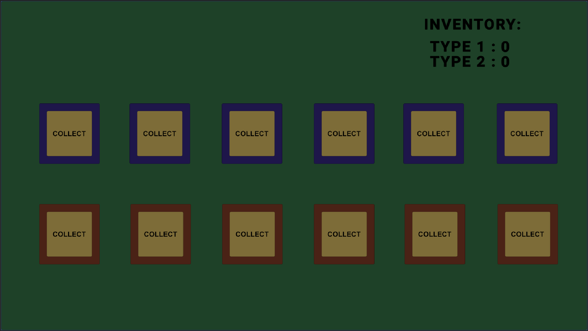

# Unity Dependencies Learning Project

This Unity project is a learning exercise focused on understanding **dependencies** in Unity and their proper management. The goal is to explore various approaches to referencing and using components like `Inventory` in Unity projects, highlighting their pros and cons.



---

## Features

- **Tile Collection System**:
  - Collect different types of tiles (`Tile_1` and `Tile_2`).
  - Destroy tiles upon collection and update the inventory dynamically.

- **Inventory Management**:
  - Tracks and displays the count of different tile types in real-time.
  - Uses Unity's serialization system to auto-initialize the inventory list.

- **UI Update Mechanisms**:
  - Two UI systems to explore dependency management:
    - **Without Dependency Injection** (direct references using `FindObjectOfType`).
    - **With Dependency Injection** (references passed through script).

---

## Purpose

The primary purpose of this project is to demonstrate:

1. **Serialization in Unity**:
   - How Unity automatically initializes public fields in MonoBehaviours.

2. **Dependency Management**:
   - Comparing hardcoded dependencies vs. dependency injection approaches.
   - Highlighting how dependency management impacts maintainability and scalability.

3. **Real-Time Updates**:
   - Updating UI elements dynamically based on gameplay events like tile collection.

---

## Scripts

### **1. GameManager.cs**
Manages the addition of tiles to the player's inventory. Handles destroying collected tiles and updating the inventory.

```csharp
public class GameManager : MonoBehaviour { ... }
```
   - Adds tiles to the inventory (`Tile_1` or `Tile_2`).
   - Logs actions for debugging purposes.

### **2. Inventory.cs**
Handles the player's inventory. Tracks all collected items and calculates counts for specific item types.

```csharp
public class Inventory : MonoBehaviour { ... }
```
   - Uses a `List<string>` to store collected items.
   - Dynamically calculates item counts using the `GetCount` method.

### **3. UIHandlerExpnsive.cs**
Updates the inventory UI without dependency injection by repeatedly finding the `Inventory` object.

```csharp
public class UIHandlerExpnsive : MonoBehaviour { ... }
```
   - Uses `FindObjectOfType<Inventory>` in the Update method.
   - Demonstrates a less efficient approach to dependency management.

### **4. UIHandlerWithDependency.cs**
Updates the inventory UI using dependency injection to retrieve the `Inventory` reference once.

```csharp
public class UIHandlerWithDependency : MonoBehaviour { ... }
```
   - Retrieves the Inventory reference in the `Start` method.
   - Demonstrates a more efficient and maintainable approach to dependency management.

# Learning Notes

## Unity Serialization
Unity auto-initializes public fields in `MonoBehaviours`. This project demonstrates that you can rely on Unity's serialization system for initializing `List<string>` fields in the Editor, but it's good practice to explicitly initialize fields when needed.

---

## Dependency Management Approaches

### Without Dependency Injection:
- Simple to implement.
- Can lead to performance overhead due to repetitive searches (`FindObjectOfType`).
- Harder to scale and maintain.

### With Dependency Injection:
- Efficient and scalable.
- Reduces coupling between components.
- Improves maintainability and code clarity.
